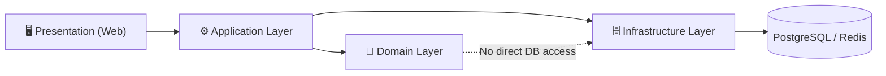

# 📐 Requiem Nexus Architecture

## 🪐 Antigravity Architecture

Requiem Nexus follows the **Antigravity Philosophy**:

> Systems must reduce cognitive weight, not add to it.

This document defines the **architectural laws** of the system.  
Breaking these rules requires explicit justification and documentation.

---

## 🧠 Antigravity Rules of Thumb

These rules apply to **all layers**: UI, application logic, domain logic, and infrastructure.

1. **If it’s implicit, it’s a bug waiting to happen**  
   All state transitions must be explicit and traceable.

2. **State must be visible or eliminable**  
   Hidden state is forbidden. Cached state must be invalidatable.

3. **Magic is debt**  
   Framework conveniences are acceptable only when fully understood and documented.

4. **Traceability beats cleverness**  
   Code should be readable by a tired developer at 2 a.m.

5. **One reason to change per module**  
   Violations of SRP are architectural defects.

6. **No silent failure—ever**  
   Fail fast, log clearly, surface safely.

7. **Teach the system by reading the code**  
   Code is documentation. Comments explain _why_, not _what_.

8. **If debugging is hard, the design is wrong**  
   Debuggability is a first-class requirement.

9. **Performance is a feature, not an optimization**  
   Efficiency must be designed, not retrofitted.

10. **Every shortcut must be temporary—and documented**  
    Technical debt must have a due date.

11. **Automation is Documentation**  
    If a deployment, build, or test step isn't automated in CI/CD, it doesn't effectively exist.

---

## 🗺️ Request Flow

Every user action flows through the layers in one direction:

Dependencies **always point inward**. Infrastructure is a plugin to the domain, not the other way around.

---

## 🧱 Architectural Layers

The system is structured into **explicit layers** with strict boundaries.

### 1. Presentation Layer (`Web`)

- UI components and reactive state
- No business rules
- No database access
- All inputs validated before passing inward
- **Real-Time boundaries**: The SignalR Hub is owned by the Web layer. It pushes state updates to clients in response to Application-layer events. It holds **no authoritative game state**—it is a pure output channel.

**Allowed dependencies:** Application layer only

---

### 2. Application Layer

- Orchestrates use cases
- Coordinates domain operations
- Handles authorization and validation flows

**Must not:**

- Contain persistence logic
- Encode game rules directly

---

### 3. Domain Layer

- Game rules and invariants
- Derived stat calculations
- Dice mechanics logic

This layer is:

- Stateless
- Deterministic
- Fully unit-testable

---

### 4. Infrastructure Layer (`Data`, external services)

- EF Core mappings
- Database migrations
- External integrations (Redis, Identity, etc.)
- **Open API / Extensibility**: Any external entry points (REST/gRPC) must reside here, secured via the same zero-trust principles as the primary UI.

Infrastructure **serves** the domain, never the reverse.

---

## 🧬 Domain Boundaries

Each domain owns:

- Its own models
- Its own invariants
- Its own persistence mappings

Cross-domain interaction is only allowed via **explicit contracts**.

🚫 Shared “Common” or “Utils” projects are forbidden.

---

## 🔁 State Management Rules

- All mutable state changes must be:
  - Intentional
  - Logged
  - Observable
- **Event Sourcing (Audit Trails)**: Critical domain transitions (e.g., spending XP, suffering Aggravated damage) must be recorded as explicit historical events, rather than just mutating the current value.
- Derived state must never be stored unless proven necessary.

---

## 🎲 Dice Nexus Architecture

- Dice rolls are:
  - Stateless
  - Deterministic when seeded
  - Auditable

- No UI component performs probability logic directly.

---

## 🧭 Observability as Architecture

Every major action emits:

- Logs (who, what, when)
- Metrics (frequency, latency)
- Correlation IDs

If it cannot be observed, it is architecturally incomplete.

---

## 🧪 Testing Architecture & Boundaries

Testing follows our structural layers, ensuring stability without fragile test setups:

- **Domain Layer → `RequiemNexus.Tests.Unit`**  
  Must be 100% unit-testable. Tests must be deterministic and run entirely in memory without infrastructure dependencies (no database access, no network calls).
- **Infrastructure Layer → `RequiemNexus.Tests.Integration`**  
  Validated via Integration tests against a real (or Dockerized) test database to ensure EF Core mappings and external integrations behave correctly.
- **Presentation Layer → `RequiemNexus.Tests.E2E`**  
  Verified via End-to-End (E2E) tests simulating real user interactions and flows.

---

## ⚙️ Configuration & Environment Strategy

- Environment differences (Local vs. AWS Cloud) are managed explicitly via configuration, not by conditional code logic (e.g., `#if DEBUG`).
- The application secures connections differently based on environment (e.g., local connection strings in development; AWS Secrets Manager in production).
- Configuration loading must fail fast on startup if required values are missing.

---

## ☁️ Deployment Topology (AWS)

While Requiem Nexus is deployed to the cloud (AWS), it retains the Antigravity philosophy:

| Component | AWS Service | Notes |
|---|---|---|
| Web Application | ECS (Fargate) | Stateless, no durable app state |
| Container Registry | ECR | Built images pushed from CI/CD |
| Relational Database | RDS (PostgreSQL) | Managed, encrypted at rest |
| Distributed Cache | ElastiCache (Redis) | Session and transient state |
| Secrets Management | AWS Secrets Manager | No secrets in source control |
| Load Balancing | Application Load Balancer | HTTPS termination |

- **Stateless Web Nodes:** Application servers hold no durable state, enabling seamless horizontal scaling.
- **Managed Persistence:** Databases and caches are pushed to managed services to reduce operational cognitive load.
- **Explicit Infrastructure:** All infrastructure is defined explicitly (IaC), never configured manually through the AWS Console.

---

## 🚫 Architectural Non-Goals

- Generic VTT behavior
- Implicit “magic” pipelines
- Framework-driven design
- Shared mutable state across domains

---

> _Architecture is frozen intent.  
> Make it intentional._
