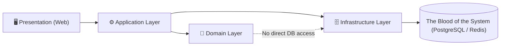

# 📐 Requiem Nexus Architecture

## 🪐 Antigravity Architecture

Requiem Nexus follows the **Antigravity Philosophy**:

> Systems must reduce cognitive weight, not add to it.

This document defines the **architectural laws** of our covenant. Breaking these rules requires explicit justification and a documented inquisition.

---

## 🧠 Antigravity Rules of Thumb

These rules apply to **all layers**: UI, application logic, domain logic, and infrastructure.

1. **If it’s implicit, it’s a bug waiting to happen**  
   All state transitions must be explicit and traceable. "Magic" is forbidden.
2. **State must be visible or eliminable**  
   Hidden state is a vulnerability. Cached state must be invalidatable.
3. **Magic is debt**  
   Framework conveniences are acceptable only when fully understood, explicit, and documented.
4. **Traceability beats cleverness**  
   Code should be readable by a tired developer at 2 a.m. 
5. **One reason to change per module**  
   Violations of SRP are architectural defects.
6. **No silent failure—ever**  
   Fail fast, log clearly, surface safely.
7. **Teach the system by reading the code (The Grimoire)**  
   Every line of code is an intentional strike against technical debt. Comments explain _why_, not _what_. Use C# 14 syntax to clarify intent.
8. **If debugging is hard, the design is wrong**  
   Debuggability is a first-class requirement.
9. **Performance is a feature, not an optimization**  
   Efficiency must be designed, not retrofitted.
10. **Every shortcut must be temporary—and documented**  
    Technical debt must have a due date.
11. **Automation is Documentation**  
    If a deployment, build, or test step isn't automated via a PowerShell script or a GitHub Action, it doesn't effectively exist.

---

## 🗺️ Request Flow

Every user action flows through the layers in a strict, traceable lineage:

Dependencies **always point inward**. Infrastructure is a plugin to the domain, never the reverse.

---

## 🧱 Architectural Layers

The system is structured into **explicit layers** with strict boundaries, upheld as Sacred Covenants.

### 1. Presentation Layer (`Web`)

- UI components and reactive state, painted in bone-white and crimson.
- No business rules.
- No database access.
- All inputs validated before passing inward past the Masquerade.
- **Real-Time boundaries**: The SignalR Hub is owned by the Web layer. It pushes state updates to clients but holds **no authoritative game state**—it is a pure output channel.

### 2. Application Layer

- Orchestrates use cases and coordinates domain operations.
- Handles authorization and validation flows.
- **Must not** contain persistence logic or encode game rules directly.

### 3. Domain Layer

- Game rules, invariants, and derived stat calculations.
- Stateless, Deterministic, and fully unit-testable.

### 4. Infrastructure Layer (`Data`, external services)

- EF Core mappings and database migrations.
- External integrations (Redis, Identity, etc.).
- Infrastructure **serves** the domain, never the reverse.

---

## 🧬 Domain Boundaries (The Sacred Covenants)

Each domain owns:
- Its own models
- Its own invariants
- Its own persistence mappings

Cross-domain interaction is only allowed via **explicit contracts**. 
🚫 Shared “Common” or “Utils” projects are strictly forbidden. The Modular Monolith boundaries are **Sacred Covenants**.

---

## 🔁 State Management Rules

- Mutable state changes must be Intentional, Logged, and Observable.
- **Event Sourcing (Audit Trails)**: Critical domain transitions (e.g. spending XP) must be recorded as explicit historical events.
- Derived state must never be stored unless proven necessary.

---

## 🎲 Dice Nexus Architecture

- Dice rolls are stateless, deterministic when seeded, and auditable.
- No UI component performs probability logic directly.

---

## 🧭 Observability as Architecture

Every major action emits Logs, Metrics, and Correlation IDs. If it cannot be observed, it is architecturally incomplete. Any anomaly is investigated via formal inquisition.

---

## 🧪 Testing Architecture & Boundaries

Testing validates that our Covenants hold without fragile setup:
- **Domain Layer → `RequiemNexus.Tests.Unit`**: 100% unit-testable. Deterministic. Runs purely in-memory.
- **Infrastructure Layer → `RequiemNexus.Tests.Integration`**: Validates EF Core mappings against The Blood of the System via Dockerized test databases.
- **Presentation Layer → `RequiemNexus.Tests.E2E`**: Verified via End-to-End tests simulating real user interactions.

---

## ⚙️ Configuration & Environment Strategy

- The Haven (Local Development) vs The Global Nexus (Cloud) are managed explicitly via configuration, not by conditional code logic (e.g., `#if DEBUG`).
- Configuration loading must fail fast on startup if required values are missing.

---

## ☁️ Deployment Topology (AWS)

While deployed to the cloud, Requiem Nexus retains the Antigravity philosophy:
- **Stateless Web Nodes (ECS Fargate)**: Application servers hold no durable state, enabling seamless horizontal scaling.
- **Managed Persistence (The Blood)**: RDS (PostgreSQL) and ElastiCache (Redis) are managed explicitly to reduce operational cognitive load.
- **Explicit Infrastructure**: All infrastructure is defined via IaC. Zero manual AWS Console configuring.

---

> _Architecture is frozen intent. Make it intentional._
