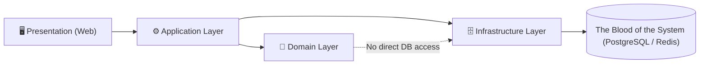

# 📐 Requiem Nexus Architecture

## 🪐 Antigravity Architecture

Requiem Nexus follows the **Antigravity Philosophy**:

> Systems must reduce cognitive weight, not add to it.

This document defines the **architectural laws** of our covenant. Breaking these rules requires explicit justification and a documented inquisition.

---

## 🧠 Antigravity Rules of Thumb

These rules apply to **all layers**: UI, application logic, domain logic, and infrastructure.

1. **If it’s implicit, it’s a bug waiting to happen**  
   All state transitions must be explicit and traceable. "Magic" is forbidden.
2. **State must be visible or eliminable**  
   Hidden state is a vulnerability. Cached state must be invalidatable.
3. **Magic is debt**  
   Framework conveniences are acceptable only when fully understood, explicit, and documented.
4. **Traceability beats cleverness**  
   Code should be readable by a tired developer at 2 a.m. 
5. **One reason to change per module**  
   Violations of SRP are architectural defects.
6. **No silent failure—ever**  
   Fail fast, log clearly, surface safely.
7. **Teach the system by reading the code (The Grimoire)**  
   Every line of code is an intentional strike against technical debt. Comments explain _why_, not _what_. Use C# 14 syntax to clarify intent.
8. **If debugging is hard, the design is wrong**  
   Debuggability is a first-class requirement.
9. **Performance is a feature, not an optimization**  
   Efficiency must be designed, not retrofitted.
10. **Every shortcut must be temporary—and documented**  
    Technical debt must have a due date.
11. **Automation is Documentation**  
    If a deployment, build, or test step isn't automated via a PowerShell script or a GitHub Action, it doesn't effectively exist.

---

## 🗺️ Request Flow

Every user action flows through the layers in a strict, traceable lineage:



Dependencies **always point inward**. Infrastructure is a plugin to the domain, never the reverse.

---

## 🧱 Architectural Layers

The system is structured into **explicit layers** with strict boundaries, upheld as Sacred Covenants.

### 1. Presentation Layer (`Web`)

- UI components and reactive state, painted in bone-white and crimson.
- No business rules.
- No database access.
- All inputs validated before passing inward past the Masquerade.
- **Real-Time boundaries**: The SignalR Hub is owned by the Web layer. It pushes state updates to clients but holds **no authoritative game state**—it is a pure output channel.

### 2. Application Layer

- Orchestrates use cases and coordinates domain operations.
- Handles authorization and validation flows.
- **Must not** contain persistence logic or encode game rules directly.

### 3. Domain Layer

- Game rules, invariants, and derived stat calculations.
- Stateless, Deterministic, and fully unit-testable.

### 4. Infrastructure Layer (`Data`, external services)

- EF Core mappings and database migrations.
- External integrations (Redis, Identity, etc.).
- Infrastructure **serves** the domain, never the reverse.

---

## 🧬 Domain Boundaries (The Sacred Covenants)

Each domain owns:
- Its own models
- Its own invariants
- Its own persistence mappings

Cross-domain interaction is only allowed via **explicit contracts**. 
🚫 Shared “Common” or “Utils” projects are strictly forbidden. The Modular Monolith boundaries are **Sacred Covenants**.

---

## 🔁 State Management Rules

- Mutable state changes must be Intentional, Logged, and Observable.
- **Event Sourcing (Audit Trails)**: Critical domain transitions (e.g. spending XP, resolving Conditions, awarding Beats) must be recorded as explicit historical events.
- Derived state must never be stored unless proven necessary.

---

## 🎲 Dice Nexus Architecture

- Dice rolls are stateless, deterministic when seeded, and auditable.
- No UI component performs probability logic directly.
- Roll results are immutable records — once emitted, they cannot be altered.

---

## ⚠️ Error Handling & Resilience

Errors are not exceptions to the architecture — they **are** architecture.

### Error Flow by Layer

| Layer | Strategy | Example |
|-------|----------|---------|
| **Domain** | Returns `Result<T>` — never throws for expected failures | "Insufficient XP to purchase dot" |
| **Application** | Translates domain results into user-facing outcomes | Maps `Result.Failure` → appropriate HTTP status or UI message |
| **Infrastructure** | Catches external failures, wraps in domain-friendly types | DB timeout → `PersistenceException` |
| **Presentation** | Displays **Player-Safe Errors** to users, logs full diagnostics | "Something went wrong" + correlated Serilog entry |

### Rules

- **Exceptions are for exceptional things** — network failures, null refs, corrupted state. Never for business logic.
- **No swallowed exceptions** — every `catch` must log or rethrow. Silent failure is a covenant violation.
- **Correlation IDs on every error** — a player can report an error code, and a developer can trace the full chain.

---

## 🛡️ Security Architecture (The Masquerade)

Security is an architectural concern, not a feature bolted on afterward.

### Authorization Boundaries

- **Authentication** is handled by ASP.NET Core Identity in the Infrastructure Layer.
- **Authorization checks** live in the **Application Layer** — every use case verifies ownership before executing.
- The Presentation Layer **never** makes authorization decisions; it only reflects the outcome.

### BOLA / IDOR Prevention Pattern

Every data-mutating operation follows this pattern:

1. Extract the authenticated user's ID from the security context.
2. Load the target entity.
3. **Verify ownership** — if `entity.OwnerId != currentUserId`, reject with `403 Forbidden`.
4. Proceed only after ownership is confirmed.

This pattern is **not optional**. Skipping step 3 is a security defect.

### Secrets Flow

- Local development: `dotnet user-secrets` or `.env` files (never committed).
- Staging / Production: AWS Secrets Manager, injected via environment variables at container startup.
- Connection strings, API keys, and signing keys **never** appear in `appsettings.json` or source code.

---

## 📡 Real-Time Architecture (The Blood Communion)

Real-time communication enables live play sessions.

### Hub Topology

- A single **SignalR Hub** handles all real-time communication.
- Clients join **chronicle-scoped groups** — messages are broadcast only to players in the active session.
- The Hub is a **thin relay** — it invokes Application Layer services and pushes results. It holds **no authoritative state**.

### Data Flow Rules

| Channel | Use Case |
|---------|----------|
| **SignalR (Push)** | Dice roll results, Condition changes, Beat awards, initiative updates, presence indicators |
| **REST (Pull)** | Character CRUD, Chronicle management, XP spending, full state hydration on connect/reconnect |

### Reconnection Strategy

- On disconnect, the client enters a **reconnection loop** with exponential backoff.
- On reconnect, the client requests a **full state snapshot** via REST to ensure consistency.
- Missed SignalR messages during disconnection are **not replayed** — the state snapshot is the source of truth.

---

## 📴 Offline & PWA Sync Architecture (The Hidden Refuge)

Offline play is an architectural constraint, not an afterthought.

### Offline Strategy

- The **Service Worker** caches the application shell and critical assets for offline access.
- Character data is stored locally in **IndexedDB** for offline read/write.
- The **Dice Nexus** runs entirely client-side when offline — no server dependency.

### Sync & Conflict Resolution

- Offline mutations are recorded as an **event queue** (event-sourced).
- On reconnect, queued events are replayed against the server.
- **Conflict policy**: Last-write-wins with conflict detection. If the server state has diverged, the player is presented with a **merge/override UI** — no silent overwrites.

---

## 🧭 Observability as Architecture

Nothing important happens silently. If a behavior cannot be observed, the architecture is incomplete.

### Observability Stack

| Pillar | Tool | Purpose |
|--------|------|---------|
| **Logs** | Serilog (structured JSON) | Machine-queryable, human-readable event logs |
| **Metrics** | OpenTelemetry | Dice roll latency, XP transactions, active sessions |
| **Tracing** | OpenTelemetry | Distributed trace spans across layers |
| **Alerts** | Monitoring dashboards | Threshold-based alerts for latency, error rate, and resource usage |

### Rules

- Every request carries a **Correlation ID** — traceable from the UI through every layer to the database.
- Every domain event (dice roll, XP spend, Condition resolution) emits a structured log entry **and** a metric.
- **Player-Safe Errors**: Users see friendly messages. Developers see the full stack trace, correlation ID, and input state.
- Any anomaly is investigated via formal inquisition.

---

## 🧪 Testing Architecture & Boundaries

Testing validates that our Covenants hold without fragile setup:
- **Domain Layer → `RequiemNexus.Domain.Tests`**: 100% unit-testable. Deterministic. Runs purely in-memory.
- **Infrastructure Layer → `RequiemNexus.Data.Tests`**: Validates EF Core mappings against The Blood of the System via Dockerized test databases.
- **Performance → `RequiemNexus.PerformanceTests`**: Load and latency tests enforcing performance budgets.
- **Presentation Layer → E2E Tests**: Verified via End-to-End tests simulating real user interactions.

---

## ⚙️ Configuration & Environment Strategy

Configuration is explicit, layered, and validated.

### Environments

| Environment | Config File | Orchestration |
|-------------|-------------|---------------|
| **Local (The Haven)** | `appsettings.Development.json` | .NET Aspire manages services, databases, and Redis |
| **Staging** | `appsettings.Staging.json` | AWS ECS with staging-specific secrets |
| **Production** | `appsettings.Production.json` | AWS ECS with production secrets via Secrets Manager |

### Rules

- No conditional compilation (`#if DEBUG` is forbidden).
- Missing required configuration **fails startup immediately** — no silent defaults.
- Secrets are **never** stored in configuration files or the repository.
- Environment-specific behavior is driven by configuration values, not code branches.

---

## 🏎️ Performance Architecture

Performance is a feature, not an optimization applied after the fact.

### Performance Budgets

| Metric | Target | Enforcement |
|--------|--------|-------------|
| Dice roll latency | < 200ms | PerformanceTests + CI |
| Character sheet TTI | < 1.5s | Lighthouse in CI |
| API response time (p95) | < 300ms | PerformanceTests + OpenTelemetry alerts |

### Caching Strategy (Redis)

| What | TTL | Invalidation |
|------|-----|--------------|
| Session tokens | Sliding, per cookie config | Explicit on logout / revocation |
| Character derived stats | Short (e.g., 60s) | Invalidated on any attribute mutation |
| Game reference data (Clans, Covenants, Disciplines) | Long (e.g., 24h) | Invalidated on seed data update |

### Query Rules

- **No N+1 queries** — all related data loaded via eager loading or explicit `.Include()`.
- **Use projections** — select only the columns needed. No `SELECT *` equivalents.
- **Pagination required** — any endpoint returning a list must support pagination.
- Performance is measured via **OpenTelemetry spans** on every database call and HTTP request.

---

## 🗃️ Schema Evolution & Migration Strategy

The database schema is a covenant — changes must be deliberate and reversible.

### Rules

- **All schema changes** require an EF Core migration. Manual SQL against production is forbidden.
- **Migrations are forward-only** — down migrations are not relied upon for rollback. Instead, a new corrective migration is created.
- **Breaking changes** (column renames, type changes) require a multi-step migration: add new → migrate data → remove old.
- **Seed data** (`DbInitializer`) evolves alongside migrations. New reference data (Clans, Disciplines, Conditions) is added via the initializer and tested in CI.
- **CI validation**: Every PR runs migrations against an empty database to verify they apply cleanly.

---

## ☁️ Deployment Topology (AWS)

While deployed to the cloud, Requiem Nexus retains the Antigravity philosophy:
- **Stateless Web Nodes (ECS Fargate)**: Application servers hold no durable state, enabling seamless horizontal scaling.
- **Managed Persistence (The Blood)**: RDS (PostgreSQL) and ElastiCache (Redis) are managed explicitly to reduce operational cognitive load.
- **Explicit Infrastructure**: All infrastructure is defined via IaC. Zero manual AWS Console configuring.

---

## 📁 Repository Structure

The repository follows a strict, navigable layout.

```
RequiemNexus/
├── .github/                  # GitHub Actions, PR templates, workflows
├── docs/                     # Architecture.md, mission.md
├── scripts/                  # PowerShell automation (build, test, deploy)
├── src/
│   ├── RequiemNexus.Data/    # Infrastructure Layer — EF Core, migrations, repositories
│   ├── RequiemNexus.Domain/  # Domain Layer — game rules, models, invariants
│   ├── RequiemNexus.Web/     # Presentation Layer — Blazor components, SignalR hubs
│   └── RequiemNexus.slnx     # Solution file
├── tests/
│   ├── RequiemNexus.Domain.Tests/       # Unit tests (deterministic, in-memory)
│   ├── RequiemNexus.Data.Tests/         # Integration tests (EF Core, Dockerized DB)
│   └── RequiemNexus.PerformanceTests/   # Load and latency tests
├── .editorconfig             # Code style enforcement
├── Directory.Packages.props  # Central NuGet package management
├── Contributing.md           # Developer onboarding guide
├── README.md                 # Project overview
└── SECURITY.md               # Security policy and vulnerability reporting
```

Every directory has a clear owner. If a file doesn't have an obvious home, the structure is wrong.

---

> _Architecture is frozen intent. Make it intentional._
