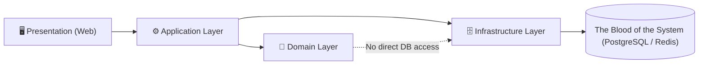

# 📐 Requiem Nexus Architecture

## 🪐 Antigravity Architecture

Requiem Nexus follows the **Antigravity Philosophy**:

> Systems must reduce cognitive weight, not add to it.

This document defines the **architectural laws** of our covenant. Breaking these rules requires explicit justification and a documented inquisition.

---

## 🧠 Antigravity Rules of Thumb

These rules apply to **all layers**: UI, application logic, domain logic, and infrastructure.

1. **If it's implicit, it's a bug waiting to happen**  
   All state transitions must be explicit and traceable. "Magic" is forbidden.
2. **State must be visible or eliminable**  
   Hidden state is a vulnerability. Cached state must be invalidatable.
3. **Magic is debt**  
   Framework conveniences are acceptable only when fully understood, explicit, and documented.
4. **Traceability beats cleverness**  
   Code should be readable by a tired developer at 2 a.m.
5. **One reason to change per module**  
   Violations of SRP are architectural defects.
6. **No silent failure—ever**  
   Fail fast, log clearly, surface safely.
7. **Teach the system by reading the code (The Grimoire)**  
   Every line of code is an intentional strike against technical debt. Comments explain _why_, not _what_. Use C# 14 syntax to clarify intent.
8. **If debugging is hard, the design is wrong**  
   Debuggability is a first-class requirement.
9. **Performance is a feature, not an optimization**  
   Efficiency must be designed, not retrofitted.
10. **Every shortcut must be temporary—and documented**  
    Technical debt must have a due date.
11. **Automation is Documentation**  
    If a deployment, build, or test step isn't automated via a PowerShell script or a GitHub Action, it doesn't effectively exist.

---

## 🗺️ Request Flow

Every user action flows through the layers in a strict, traceable lineage:



Dependencies **always point inward**. Infrastructure is a plugin to the domain, never the reverse.

---

## 🧱 Architectural Layers

The system is structured into **explicit layers** with strict boundaries, upheld as Sacred Covenants.

### 1. Presentation Layer (`RequiemNexus.Web`)

- UI components and reactive state, painted in bone-white and crimson.
- No business rules.
- No database access.
- All inputs validated before passing inward past the Masquerade.
- **Real-Time boundaries**: The SignalR Hub is owned by the Web layer. It pushes state updates to clients but holds **no authoritative game state** — it is a pure output channel.

### 2. Application Layer (`RequiemNexus.Application`)

- Orchestrates use cases and coordinates domain operations.
- Handles authorization and validation flows.
- **Must not** contain persistence logic or encode game rules directly.
- Every use case verifies ownership before executing — authorization is enforced here, never in the Presentation layer.

### 3. Domain Layer (`RequiemNexus.Domain`)

- Game rules, invariants, and derived stat calculations.
- Stateless, deterministic, and fully unit-testable.
- **No dependency** on `Data`, `Web`, or `Application`.

### 4. Infrastructure Layer (`RequiemNexus.Data`)

- EF Core mappings and database migrations.
- External integrations (Redis, Identity, email, etc.).
- Infrastructure **serves** the domain — it never drives it.

---

## 🧬 Domain Boundaries (The Sacred Covenants)

Each domain owns:
- Its own models
- Its own invariants
- Its own persistence mappings

Cross-domain interaction is only allowed via **explicit contracts**.  
🚫 Shared `Common` or `Utils` projects are strictly forbidden. The Modular Monolith boundaries are **Sacred Covenants**.

---

## 🔁 State Management Rules

- Mutable state changes must be Intentional, Logged, and Observable.
- **Event Sourcing (Audit Trails)**: Critical domain transitions (e.g. spending XP, resolving Conditions, awarding Beats) must be recorded as explicit historical events.
- Derived state must never be stored unless proven necessary.

---

## 🎲 Dice Nexus Architecture

- Dice rolls are stateless, deterministic when seeded, and auditable.
- No UI component performs probability logic directly.
- Roll results are immutable records — once emitted, they cannot be altered.

### Unified Pool Resolver (Phase 8+)

The Dice Nexus resolves pools from a single, unified source regardless of the component types involved. 

- **Phase 8**: Pools composed of Attributes, Skills, and Discipline ratings (additive only).
- **Phase 9**: Extended to support **Contested Rolls** (`vs` format), **Penalty Dice** (`Pool - Stat`), and **Lower Discipline** logic.
- **Phase 11**: **Equipment** modifiers from `ITraitResolver` / inventory (skill assists, weapon damage dice, strength under-requirement penalties) feed the same pool path as traits and sorcery-driven modifiers.

**The resolver must treat all traits as first-class inputs.** A pool definition is a declarative list of typed references — `{ type: Attribute, name: "Wits" }`, `{ type: Skill, name: "Subterfuge" }`, `{ type: Discipline, name: "Obfuscate", minimumRating: 2 }` — and the resolver hydrates each from its respective domain, applies any active modifiers, and emits a `DicePool` value object. No caller constructs a raw integer pool directly.

This design ensures that Devotions (Phase 8), Blood Sorcery (Phase 9), and Equipment modifiers (Phase 11) all feed into the same resolution path.

---

## ⚙️ Passive Modifier Engine (Phase 9+)

Many advanced Kindred powers (Devotions, Coils, Covenant benefits) and **equipped catalog gear (Phase 11)** provide permanent or conditional stat deltas rather than active rolls, where applicable.

- **Stateless Aggregation**: Modifiers are never "applied" to a base stat permanently. Instead, an `IModifierService` aggregates all active `PassiveModifier` records for a character at the moment a stat is requested.
- **Modifier Types**:
    - **Static**: Persistent bonus/penalty to a Trait or derived stat (e.g., +1 Speed).
    - **Conditional**: Modifiers that apply only under specific circumstances (e.g., +2 to resist frenzy).
    - **Rule-Breaking**: Modifiers that alter core engine behavior (e.g., "Ignore wound penalties," handled by explicit flags).
- **Injection**: The `TraitResolver` and derived stat calculators (Health, Speed, Defense) must query the `IModifierService` to ensure all deltas are accounted for before returning a value.

---

## ⚠️ Error Handling & Resilience

Errors are not exceptions to the architecture — they **are** architecture.

### Error Flow by Layer

| Layer | Strategy | Example |
|-------|----------|---------|
| **Domain** | Returns `Result<T>` — never throws for expected failures | "Insufficient XP to purchase dot" |
| **Application** | Translates domain results into user-facing outcomes | Maps `Result.Failure` → appropriate HTTP status or UI message |
| **Infrastructure** | Catches external failures, wraps in domain-friendly types | DB timeout → `PersistenceException` |
| **Presentation** | Displays **Player-Safe Errors** to users, logs full diagnostics | "Something went wrong" + correlated Serilog entry |

### Rules

- **Exceptions are for exceptional things** — network failures, null refs, corrupted state. Never for business logic.
- **No swallowed exceptions** — every `catch` must log or rethrow. Silent failure is a covenant violation.
- **Correlation IDs on every error** — a player can report an error code, and a developer can trace the full chain.

---

## 🛡️ Security Architecture (The Masquerade)

Security is an architectural concern, not a feature bolted on afterward.

### Authorization Boundaries

- **Authentication** is handled by ASP.NET Core Identity in the Infrastructure Layer (cookie sessions for the Blazor app; JWT or other bearer schemes are out of scope until a separate public API is introduced).
- **Authorization checks** live in the **Application Layer** — every use case verifies ownership before executing.
- The Presentation Layer **never** makes authorization decisions; it only reflects the outcome.

### BOLA / IDOR Prevention Pattern

Every data-mutating operation follows this pattern:

1. Extract the authenticated user's ID from the security context.
2. Load the target entity.
3. **Verify ownership** — if `entity.OwnerId != currentUserId`, reject with `403 Forbidden`.
4. Proceed only after ownership is confirmed.

This pattern is **not optional**. Skipping step 3 is a security defect.

### Secrets Flow

- Local development: `dotnet user-secrets` (never committed).
- Staging / Production: AWS Secrets Manager, injected via environment variables at container startup.
- Connection strings, API keys, and signing keys **never** appear in `appsettings.json` or source code.

---

## 📡 Real-Time Architecture (The Blood Communion)

Real-time communication enables live play sessions.

### Hub Topology

- A single **SignalR Hub** handles all real-time communication.
- Clients join **chronicle-scoped groups** — messages are broadcast only to players in the active session.
- The Hub is a **thin relay** — it performs authentication/authorization via `ISessionAuthorizationService` and delegates all logic to the Application Layer. It holds **no authoritative state**.
- **Redis Backplane**: Redis is configured as the SignalR backplane to distribute messages across horizontally scaled nodes.
- **Ephemeral State (Redis)**: Session state (active players, initiative order, recent rolls) is stored in Redis with a 15-minute sliding TTL. No database entities are created for play sessions.
- **Server-Side Authority**: All dice rolls are performed on the server via `DiceService`. Clients request a roll; the server broadcasts the result.
- **Latency SLA**: Server dispatch time (hub method start to group broadcast) must be ≤ 200ms p95.

### Data Flow Rules

| Channel | Use Case |
|---------|----------|
| **SignalR (Push)** | Dice roll results, Condition changes, Beat awards, initiative updates, presence indicators |
| **REST (Pull)** | Character CRUD, Chronicle management, XP spending, full state snapshot hydration |

### Reconnection Strategy

- On disconnect, the client enters a **reconnection loop** with exponential backoff.
- On reconnect, the client requests a **full state snapshot** via REST (`/api/sessions/{id}/state`) to ensure consistency.
- Missed SignalR messages during disconnection are **not replayed** — the state snapshot is the source of truth.

#### PWA/Offline Deferral
PWA and offline capabilities have been deferred indefinitely. The architectural assumption is stable connectivity at the table. Real-time synchronization takes priority.

---

## 🏗️ Layer Ownership Map

The system is organized into a modular monolith with strict dependency rules.

| Layer | Responsibility | Allowed Dependencies |
|-------|----------------|----------------------|
| **Web** | UI, SignalR Hubs, Components | Application, Data, Domain |
| **Application** | Use Case Orchestration, Authorization | Data, Domain |
| **Domain** | Rules, Invariants, Pure Logic | None |
| **Data** | Persistence, EF Core, Repositories | Domain |

> **Note on `Web → Data`:** The direct dependency from the Presentation layer to the Infrastructure layer is a deliberate, documented exception to strict inward-only dependency flow. It exists to support Blazor's component model and EF Core `DbContext` injection patterns in server-side rendering scenarios. No business logic or authorization decisions are permitted in this path — it is a data-access convenience only. Any use of this path must be reviewed during inquisition if the pattern migrates toward encoding rules.

---

## 🧭 Observability as Architecture

Nothing important happens silently. If a behavior cannot be observed, the architecture is incomplete.

### Observability Stack

| Pillar | Tool | Purpose |
|--------|------|---------|
| **Logs** | Serilog (structured JSON) | Machine-queryable, human-readable event logs |
| **Metrics** | OpenTelemetry | Dice roll latency, XP transactions, active sessions |
| **Tracing** | OpenTelemetry | Distributed trace spans across layers |
| **Dashboards** | Grafana + AWS CloudWatch | Live visualization of metrics, traces, and alerts |
| **Alerts** | CloudWatch Alarms | Threshold-based alerts for latency, error rate, and resource usage |
| **Error Tracking** | Sentry (optional, `Sentry:Dsn`) | Real-time exception alerts with stack traces when configured; Raygun or equivalents remain optional alternatives |

### Rules

- Every request carries a **Correlation ID** — traceable from the UI through every layer to the database.
- Every domain event (dice roll, XP spend, Condition resolution) emits a structured log entry **and** a metric.
- **Player-Safe Errors**: Users see friendly messages. Developers see the full stack trace, correlation ID, and input state.
- Any anomaly is investigated via formal inquisition.

---

## 🧪 Testing Architecture & Boundaries

Testing validates that our Covenants hold without fragile setup.

| Project | Layer | Approach |
|---------|-------|----------|
| `RequiemNexus.Domain.Tests` | Domain | Unit tests — deterministic, purely in-memory, no I/O |
| `RequiemNexus.Application.Tests` | Application | Integration tests — use cases, authorization flows, service orchestration; in-memory or mocked infrastructure |
| `RequiemNexus.Data.Tests` | Infrastructure | Integration tests — EF Core mappings and migrations against Dockerized PostgreSQL |
| `RequiemNexus.PerformanceTests` | Cross-cutting | Load and latency tests enforcing performance budgets via NBomber |
| E2E Tests | Presentation | End-to-end tests via Playwright (Phase 13; see `mission.md`). Active UI work is specified in `docs/UI_UX_FACELIFT.md` — coordinate selector and visual-regression updates with that plan. |

---

## 🏎️ Performance Architecture

Performance is a feature, not an optimization applied after the fact. These budgets are the **single source of truth** — referenced by `mission.md` and `agents.md` but defined only here.

### Performance Budgets

| Metric | Target | Enforcement |
|--------|--------|-------------|
| Dice roll latency | < 200ms | NBomber in CI (`RequiemNexus.PerformanceTests`) |
| Character sheet TTI | < 1.5s | Lighthouse CI audit against staging URL |
| API response time (p95) | < 300ms | NBomber in CI + OpenTelemetry alerts |

### Lighthouse CI Configuration

Lighthouse runs as a GitHub Actions step on every PR targeting `main`. It audits the staging deployment URL (`$STAGING_URL`) and fails the build if TTI exceeds 1.5s. The Lighthouse config file lives at `.github/lighthouse/config.json` and enforces the TTI budget alongside minimum scores for Performance and Accessibility.

### Caching Strategy (Redis)

| What | TTL | Invalidation Trigger |
|------|-----|----------------------|
| Session tokens | Sliding, per cookie config | Explicit on logout / revocation |
| Character derived stats | 60s | Any attribute mutation |
| Game reference data (Clans, Covenants, Disciplines) | 24h | Seed data update |
| `BloodlineDefinition` / `DevotionDefinition` | 24h | Seed data update |
| `CovenantDefinition` / `SorceryRiteDefinition` | 24h | Seed data update |
| `CoilDefinition` / `ScaleDefinition` | 24h | Seed data update |
| `Asset` catalog (TPT: weapons, armor, equipment, services) | 24h | Seed data update |
| SignalR backplane messages | Transient | Delivered and discarded |

> **Note:** Reference data (Clans, Disciplines, Bloodlines, Devotions, Covenants, Rites, **Assets**) are defined in seed, change only on deploy, and are read-heavy. They must be cached at the same TTL and share the same invalidation trigger. Do not treat them as mutable character data.

### Query Rules

- **No N+1 queries** — all related data loaded via eager loading or explicit `.Include()`.
- **Use projections** — select only the columns needed. No `SELECT *` equivalents.
- **Pagination required** — any endpoint returning a list must support pagination.
- Performance is measured via **OpenTelemetry spans** on every database call and HTTP request.

---

## ⚙️ Configuration & Environment Strategy

Configuration is explicit, layered, and validated at startup.

### Environments

| Environment | Config File | Orchestration |
|-------------|-------------|---------------|
| **Local (The Haven)** | `appsettings.Development.json` | .NET Aspire manages services, databases, and Redis |
| **Staging** | `appsettings.Staging.json` | AWS ECS with staging-specific secrets |
| **Production** | `appsettings.Production.json` | AWS ECS with production secrets via Secrets Manager |

### Rules

- No conditional compilation (`#if DEBUG` is forbidden).
- Missing required configuration **fails startup immediately** — no silent defaults.
- Secrets are **never** stored in configuration files or the repository.
- Local development databases are **local-only artifacts** (e.g. `.data/`) and must be ignored via `.gitignore` (never committed).
- Local secrets use `dotnet user-secrets`. Staging/production secrets live in AWS Secrets Manager and are injected at container startup.
- Environment-specific behavior is driven by configuration values, not code branches.

---

## 🗃️ Schema Evolution & Migration Strategy

The database schema is a covenant — changes must be deliberate and forward-only.

### Rules

- **All schema changes** require an EF Core migration. Manual SQL against production is forbidden.
- **Migrations are forward-only** — down migrations are not relied upon for rollback. A new corrective migration is created instead.
- **Breaking changes** (column renames, type changes) require a multi-step migration: add new → migrate data → remove old.
- **Seed data** (`DbInitializer`) evolves alongside migrations. New reference data (Clans, Disciplines, Conditions, Bloodlines, Devotions) is added via the initializer and tested in CI.
- **Reference (rules) data** (Clans, Merits, Disciplines, Bloodlines, Devotions, etc.) is versioned with the codebase and applied idempotently via `DbInitializer`. Corrections for existing rows ship as forward-only migrations.
- **Deploy-time migrations**: database migrations run **once per deploy** via a dedicated migration step (not "every web node on startup") to avoid race conditions in ECS.
- **CI validation**: Every PR runs migrations against an empty database to verify they apply cleanly.

---

## ☁️ Deployment Topology (AWS)

While deployed to the cloud, Requiem Nexus retains the Antigravity philosophy: no manual configuration, no hidden state.

- **Stateless Web Nodes (ECS Fargate)**: Application servers hold no durable state, enabling seamless horizontal scaling.
- **Managed Persistence (The Blood)**: RDS (PostgreSQL) and ElastiCache (Redis) are managed explicitly to reduce operational cognitive load.
- **Explicit Infrastructure**: All infrastructure is defined via IaC — **AWS CDK** is the canonical path. Zero manual AWS Console configuration.
- **Database Backups**: Automated RDS snapshots with point-in-time recovery. Player data must be recoverable to within **24 hours** of any failure — this is a non-negotiable SLA.

### CI/CD Topology (GitHub Actions)

Deployment automation is part of the architecture: it must be explicit, reproducible, and auditable.

- **Authentication to AWS**: GitHub Actions assumes an AWS IAM role via **OIDC** (no long-lived AWS access keys in GitHub secrets).
- **Environment gates**: `staging` auto-deploys from `main`; `production` requires an explicit approval gate (GitHub Environments).
- **Infrastructure preview**: PRs run `cdk synth` and `cdk diff` to surface intended changes before merge.
- **Migration ordering**: database migrations run as a **one-off** deploy step (dedicated migrator task) before updating the ECS service.
- **Concurrency**: prevent overlapping deploys per environment to avoid split-brain releases.

### AWS Service Map (Typical)

The **target** production topology (delivered via IaC across Phases 5–6) includes:

- **Networking**: VPC, public/private subnets, security groups
- **Compute & ingress**: ECS Fargate, ECR, ALB
- **Persistence**: RDS PostgreSQL, ElastiCache (Redis)
- **Secrets & identity**: Secrets Manager, IAM roles/policies
- **Email**: Amazon SES (optionally SNS for bounce/complaint routing)
- **Static & CDN**: S3 + CloudFront (for Blazor WASM assets and cache-busting)
- **Observability**: CloudWatch Logs/Metrics/Alarms (+ Grafana if used), OpenTelemetry Collector
- **DNS/TLS**: Route 53 + ACM
- **Cost controls**: AWS Budgets
- **Optional edge hardening**: AWS WAF

---

## 🩸 Content vs. Behavior (Phase 8+)

From Phase 8 onward, the domain introduces a structural distinction that must be upheld across all future phases:

> **Content is data. Behavior is code. They must never be conflated.**

| Concern | Where it lives | Example |
|---------|---------------|---------|
| What a Bloodline *is* | Seed data (`BloodlineDefinition`) | Prerequisites, Discipline substitutions, Bane descriptor |
| What a Bloodline *does* | Domain engine (stateless service) | Applies substitutions, validates character, stacks Banes |
| What a Devotion *is* | Seed data (`DevotionDefinition`) | Pool composition, XP cost, prerequisite Disciplines |
| What a Devotion *does* | Unified Pool Resolver + `DiceService` | Hydrates pool, activates roll, registers passive modifier |
| What catalog equipment *is* | Seed / DB rows (`Asset` + TPT: `WeaponAsset`, `ArmorAsset`, `EquipmentAsset`, `ServiceAsset`) | Stats, availability, capabilities (e.g. tool + weapon profile) |
| What equipment *does* | `ITraitResolver`, procurement services, Pack UI | Modifiers to pools and sheet; procurement vs. Resources; Masquerade on mutations |

A new Bloodline, Devotion, or **catalog Asset** from a sourcebook is a **migration + seed entry**, not a code change. An engine that handles a new *category* of mechanic is a code change requiring full review and testing.

This separation is the canonical pattern for all content-heavy phases (9 — Covenants, 11 — Equipment). Any deviation requires a documented inquisition.

---

## 📁 Repository Structure

The repository follows a strict, navigable layout. Every directory has a clear owner. If a file doesn't have an obvious home, the structure is wrong.

```
RequiemNexus/
├── .github/                          # GitHub Actions workflows, PR templates
│   └── lighthouse/                   # Lighthouse CI configuration
│       └── config.json
├── docs/                             # Architecture.md, mission.md, rules-interpretations.md
├── scripts/                          # PowerShell automation (build, test, deploy)
├── src/
│   ├── RequiemNexus.Application/     # Application Layer — use cases, orchestration, contracts
│   ├── RequiemNexus.Data/            # Infrastructure Layer — EF Core, migrations, repositories
│   ├── RequiemNexus.Domain/          # Domain Layer — game rules, models, invariants
│   ├── RequiemNexus.Web/             # Presentation Layer — Blazor components, SignalR hubs
│   └── RequiemNexus.slnx             # Solution file
├── tests/
│   ├── RequiemNexus.Domain.Tests/        # Unit tests (deterministic, in-memory)
│   ├── RequiemNexus.Application.Tests/   # Integration tests (use cases, authorization flows)
│   ├── RequiemNexus.Data.Tests/          # Integration tests (EF Core, Dockerized DB)
│   └── RequiemNexus.PerformanceTests/    # Load and latency tests (NBomber)
├── .editorconfig                     # Code style enforcement
├── Directory.Packages.props          # Central NuGet package management
├── claude.md                         # Agent entry point (Cursor / Claude Code rules)
├── Contributing.md                   # Developer onboarding guide
├── README.md                         # Project overview
└── SECURITY.md                       # Security policy and vulnerability reporting
```

---

> _Architecture is frozen intent. Make it intentional._