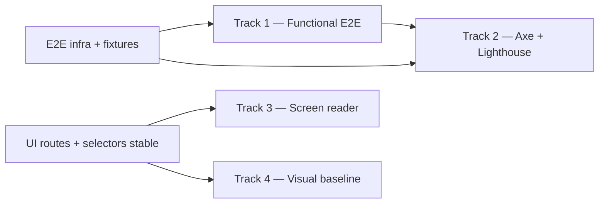

# 📅 Phase 13 — End-to-End Testing & Accessibility

> _The code must prove itself. Every critical path must be witnessed._

## Overview

Phase 13 hardens the ecosystem for all users and proves correctness across the full system stack.
It spans four tracks that can run in parallel once the shared infrastructure is in place.

**Objective:** Deliver a Playwright E2E suite covering critical paths (Phases 8–12), WCAG 2.1 AA
automated scanning in CI, screen-reader-safe ARIA live regions for real-time events, and a visual
regression baseline that guards the bone-white/crimson palette against drift.

**Active UI/UX work:** Design-token stabilisation, `SharedHeader`/mobile nav, home dashboard,
and character sheet polish run in parallel. Track 3 (Screen Reader) and Track 4 (Visual
Regression) depend on stable routes and selectors from that work — start them only after the
component tree settles.

## Phase 13 closure (record)

Phase 13 is **closed** per the phase table in [`mission.md`](./mission.md). This document remains
the Grimoire reference for what was built and what stays on the **functional E2E backlog** (the
Track 1 tables below).

**Shipped**

- **Infrastructure:** `tests/RequiemNexus.E2E.Tests` — `AppFixture` (Kestrel, `Testing`, explicit
  migrate + seed), Redis multiplexer test double, Playwright Chromium, `E2eTestDataSeed`,
  `AuthFixture` / `DataFixture` patterns, `E2eLoginHelper`, `PageExtensions`.
- **Track 2:** `A11yHelper` + `AccessibilityPageScanTests` (nine target surfaces), `.github/workflows/e2e.yml`,
  `.github/workflows/lighthouse.yml`, `.github/lighthouse/config.json` (accessibility hard gate 0.90).
- **Track 3:** `MainLayout.razor` polite/assertive regions, `wwwroot/js/announcer.js`, scoped
  `ScreenReaderAnnouncer` used by `RollHistoryFeed`, `InitiativeTracker`, `SessionPresenceBar`,
  `BloodBondsPanel`; `DotScale.razor` radiogroup + radio roles. Further modal/icon coverage is
  continuous hygiene enforced by axe in CI.
- **Track 4:** `tests/RequiemNexus.VisualRegression.Tests` — login-route PNG pipeline with
  `PLAYWRIGHT_UPDATE_SNAPSHOTS`, `PaletteAuditTests` smoke; non-blocking job in `e2e.yml`.
- **Local automation:** `scripts/test-e2e-local.ps1` (PostgreSQL + Playwright); `scripts/test-local.ps1`
  remains unit/integration + format only.

**Backlog (post–Phase 13)**

- **Track 1 matrix:** The per-scenario tests listed in §1.1–§1.9 are the expansion checklist — add
  alongside `HostReachabilityTests` as priorities dictate.
- **Track 4 baselines:** Multi-viewport `ToHaveScreenshotAsync` matrix in §4.2 is not yet committed;
  extend `RequiemNexus.VisualRegression.Tests` when UI stabilises.

### Out of scope for Phase 13

- Load / performance testing (covered by `RequiemNexus.PerformanceTests` + nightly NBomber workflow)
- Native mobile apps
- Full PWA / offline capability (deferred indefinitely per `docs/Architecture.md`)
- Full rulebook ritual catalog expansion (content-only; Phase 9.6 deferred items)

---

## Dependency order



---

## Prerequisite: Shared E2E Infrastructure

### New project: `tests/RequiemNexus.E2E.Tests`

```
tests/RequiemNexus.E2E.Tests/
├── RequiemNexus.E2E.Tests.csproj
├── Fixtures/
│   ├── AppFixture.cs           # WebApplicationFactory host; Testing env; explicit migration step
│   ├── AuthFixture.cs          # Creates Player + Storyteller; stores xUnit IAsyncLifetime state
│   └── DataFixture.cs          # Seeds per-test characters, campaigns, encounters
├── Helpers/
│   ├── PageExtensions.cs       # WaitForToastAsync, FillLabeledAsync, ClickButtonAsync
│   └── A11yHelper.cs           # axe-core injection + violation reporter
├── Tests/
│   ├── Auth/
│   ├── Character/
│   ├── Advancement/
│   ├── BloodSorcery/
│   ├── SocialManeuver/
│   ├── Pack/
│   ├── RelationshipWeb/
│   ├── Storyteller/
│   └── Realtime/
└── Snapshots/                  # Visual regression baselines (git-tracked)
```

**NuGet packages (xUnit — consistent with the rest of the test suite):**

```xml
<PackageReference Include="xunit" />
<PackageReference Include="xunit.runner.visualstudio" />
<PackageReference Include="Microsoft.Playwright" />
<PackageReference Include="Microsoft.Playwright.xunit" />
<PackageReference Include="Deque.AxeCore.Playwright" />
<PackageReference Include="Microsoft.AspNetCore.Mvc.Testing" />
```

**Solution wiring:** add `RequiemNexus.E2E.Tests` to `tests/RequiemNexus.Tests.slnx`.

### Host model

Use `WebApplicationFactory<Program>` (in-process) with `ASPNETCORE_ENVIRONMENT=Testing`.
`Testing` is the only environment value that skips both `AddStackExchangeRedis` and
auto-migrations in `Program.cs`:

```csharp
// Program.cs (existing behaviour — do not change)
if (!builder.Environment.IsEnvironment("Testing"))
    signalrBuilder.AddStackExchangeRedis(...);

bool runMigrations = isMigrateOnly || !builder.Environment.IsEnvironment("Testing");
```

Because `Testing` suppresses auto-migration, `AppFixture` must migrate explicitly:

```csharp
// Fixtures/AppFixture.cs
public sealed class AppFixture : WebApplicationFactory<Program>, IAsyncLifetime
{
    public async Task InitializeAsync()
    {
        using var scope = Services.CreateScope();
        var db = scope.ServiceProvider.GetRequiredService<ApplicationDbContext>();
        await db.Database.MigrateAsync();
        await DbInitializer.SeedAsync(db, scope.ServiceProvider);
    }
    // ...
}
```

No Redis service is required in CI: `Program.cs` already skips `AddStackExchangeRedis` when
`IsEnvironment("Testing")` is true, so SignalR falls back to the in-process backplane
automatically. No extra abstraction is needed.

### Email confirmation bypass

`IEmailSender` is registered as a `TestEmailSink` in the `Testing` environment. `AuthFixture`
reads the confirmation token directly from the sink's in-memory store, never from an external
mailbox. The `TestEmailSink` type must not be registered in `Development`, `Staging`, or
`Production` environments.

### Playwright setup

Playwright .NET uses programmatic configuration, not a JSON config file. Options are set via
`BrowserNewPageOptions` and `BrowserTypeLaunchOptions` on the xUnit `IClassFixture`:

```csharp
// Fixtures/AppFixture.cs (excerpt)
public BrowserNewContextOptions ContextOptions() => new()
{
    BaseURL       = BaseAddress.ToString(),
    ViewportSize  = new ViewportSize { Width = 1440, Height = 900 },
    RecordVideoDir = "test-results/videos/"
};
```

Timeouts: `ActionTimeout = 5_000`, `NavigationTimeout = 15_000`.
Retries: 2 in CI (`PLAYWRIGHT_RETRIES=2`), 0 locally.
Parallelism: per-class isolation — each xUnit test class gets its own `IBrowserContext`.

---

## Track 1 — Full E2E Playwright Suite

All tests are `[Fact]` (xUnit). Assertion style: `Assert.True`, `Assert.Equal`, etc.

### 1.1 Auth Flows (`Tests/Auth/`)

| Test | Scenario |
|------|----------|
| `Register_WithEmailConfirmation_Succeeds` | Full registration → `TestEmailSink` provides token → confirm → login |
| `Login_WithValidCredentials_Succeeds` | Cookie session established, home page loads |
| `Login_FailsFiveTimes_TriggersLockout` | 5 consecutive failures (matches `MaxFailedAccessAttempts = 5` in `Program.cs`) → lockout error shown |
| `TwoFactor_TOTP_Flow` | Enable TOTP → logout → login with code |
| `PasswordReset_Flow` | Request reset → `TestEmailSink` provides token → change password → login |
| `RememberMe_PersistsCookieSession` | `IsPersistent` cookie survives context restart |
| `RemoteLogout_InvalidatesOtherSession` | Second context is logged out on session revoke |

**Note:** the lockout test asserts the UI error message and the Identity lockout flag via a
direct DB query inside the fixture — it does not assert the rate-limiter middleware separately.
Rate limiter behaviour is covered by the existing `RequiemNexus.Application.Tests`.

---

### 1.2 Character Creation & Sheet (`Tests/Character/`)

| Test | Scenario |
|------|----------|
| `CreateCharacter_MinimalForm_AppearsInRoster` | Fill name + clan → save → roster shows card |
| `CharacterSheet_ShowsDerivedStats` | Health, Willpower, Speed, Defense, Initiative rendered |
| `EditCharacter_ChangeAttributeDot_UpdatesSheet` | Increment Strength → derived Speed updates |
| `DeleteCharacter_RemovesFromRoster` | Confirm delete → roster empty state |
| `DiceRoller_RollsAndShowsResult` | Open `DiceRollerModal` → set pool → roll → `ToastContainer` entry appears |
| `RollMacro_ExecutesFromSavedMacros` | Save a macro → tap it → roll result fires |
| `Conditions_AddAndResolve` | Add Shaken → resolve → Beat awarded → list empty |
| `Tilts_AddAndClear` | Add Stunned → clear → removed |

---

### 1.3 Character Evolution — Bloodlines & Devotions (`Tests/Advancement/`)

| Test | Scenario |
|------|----------|
| `ApplyForBloodline_PendingApprovalCreated` | Player applies → status shows Pending |
| `Storyteller_ApprovesBloodline_CharacterUpdated` | ST approves → bloodline section visible on sheet |
| `Storyteller_RejectsBloodline_WithNote` | ST rejects with note → player sees rejection |
| `PurchaseDevotionPrerequisiteMet_Succeeds` | XP + Discipline prereqs met → Devotion added |
| `PurchaseDevotionPrerequisiteNotMet_ShowsError` | Insufficient Discipline → validation error shown |
| `DevotionRollButton_ResolvesViaUnifiedPoolResolver` | Roll button → `DiceRollerModal` shows correct pool |
| `PassiveDevotionModifier_AppliedToSheet` | Passive modifier Devotion → derived stat incremented |
| `CovenantAssignment_UnlocksCovenantBenefits` | Assign Covenant → covenant-gated merits unlocked |

---

### 1.4 Blood Sorcery (`Tests/BloodSorcery/`)

| Test | Scenario |
|------|----------|
| `CruacRite_ActivationCostApplied` | Activate Crúac rite → Vitae deducted before pool resolves |
| `ThebanMiracle_ActivationCostApplied` | Activate Theban miracle → Willpower cost deducted |
| `SacrificeRequirement_ConfirmDialogShown` | Rite requires sacrifice → browser `confirm` fires |
| `HumanityStain_AppliedByRiteActivation` | `HumanityStain` cost → stain counter increments |
| `NecromancyRite_RequiresMekhetClan` | Non-Mekhet character → rite locked/unavailable |
| `OrdoDraculRitual_RequiresOrdoCovenant` | Non-Ordo character → ritual locked/unavailable |
| `LearnRiteModal_PurchasesRiteViaAdvancement` | Open Advancement → `ApplyLearnRiteModal` → rite on sheet |

---

### 1.5 Social Maneuvers (`Tests/SocialManeuver/`)

| Test | Scenario |
|------|----------|
| `OpenManeuver_AgainstNpc_CreatesDoors` | Start maneuver → door count initialised |
| `RollOpen_DecrementsDoor` | Open roll success → doors decrease by one |
| `ForcedRoll_RemovesAllDoorsOnFailure` | Force roll failure → all doors removed, Shaken applied |
| `HardLeverage_RemovesDoorsBeforeForce` | Apply hard leverage → door removed before force attempt |
| `ManeuverSuccess_AwardsSwooned` | Doors reach zero → Swooned condition applied |
| `InvestigationClue_BankedAndSpent` | ST adds clue → player spends clue → bank decremented |
| `DramaticFailure_AppliesShaken` | Dramatic failure on open roll → Shaken applied |
| `Impression_ShownOnSheet_AndStoryteller` | Set Impression in ST panel → reflects on sheet |

---

### 1.6 Pack / Procurement / Equipment (`Tests/Pack/`)

| Test | Scenario |
|------|----------|
| `BrowseCatalog_ShowsAllAssetTypes` | Pack tab loads; weapon, armor, equipment, service categories visible |
| `ProcureAsset_BelowResources_CreatesIllicitPending` | Resources < Availability → pending row created |
| `Storyteller_ApprovesIllicitProcurement` | ST approves → asset in inventory |
| `Storyteller_RejectsIllicitProcurement` | ST rejects → pending row removed |
| `EquipAsset_ModifiesPool` | Equip weapon → `DiceRollerModal` shows updated pool |
| `UnequipAsset_RemovesModifier` | Unequip → pool returns to base |
| `BreakAsset_DisablesModifier` | Structure → 0 → equipped modifier no longer applies |
| `ArmorMitigation_ShownOnSheet` | Equip armor → General/Ballistic ratings appear on sheet |

---

### 1.7 Relationship Web (`Tests/RelationshipWeb/`)

| Test | Scenario |
|------|----------|
| `SetSire_CreatesLineageLink` | Assign sire via `EditLineageModal` → lineage section shows sire name |
| `BloodSympathy_DisplayedAcrossLineage` | Two characters share sire → Blood Sympathy distance shown |
| `BloodBond_Stage1_AppliedByVitaeFeeding` | ST records vitae feeding via `RecordFeedingModal` → Bond stage increments |
| `BloodBond_Condition_AppliedAtStage3` | Stage 3 → Blood Bond condition applied to thrall |
| `PredatoryAura_LashOut_ContestRollResolved` | `PredatoryAuraChallengeModal` → contested Blood Potency roll fires, result applied |
| `GhoulCreation_TracksVitaeDependency` | Create ghoul via `CreateGhoulModal` → monthly vitae dependency shown |
| `GhoulAgingCheck_TriggeredCorrectly` | Advance time → aging check UI accessible to ST |

---

### 1.8 Storyteller Tools (`Tests/Storyteller/`)

| Test | Scenario |
|------|----------|
| `EncounterManager_CreateAndStartEncounter` | Create encounter → add participants → start → initiative order shown |
| `InitiativeTracker_LiveOrder_BroadcastToPlayers` | ST sets order → player window updates via SignalR |
| `XpDistribution_GroupAward_AppliedToAllPlayers` | ST awards XP to coterie → all character sheets updated |
| `BeatTracking_AwardAndConvert` | Award Beat → convert 5 Beats → 1 XP added |
| `NpcStatBlock_CreateAndDisplayInEncounter` | Create NPC stat block → add to encounter → vitals shown |
| `StorytellerGlimpse_ShowsPlayerVitals` | `StorytellerGlimpse` shows Health, Willpower, Vitae for all players |
| `CampaignNotes_CreateAndShare` | Create note → mark shared → appears in player lore view |

---

### 1.9 Real-Time / SignalR (`Tests/Realtime/`)

Tests run against the in-process host (Redis backplane suppressed by `Testing` environment).
Two `IBrowserContext` instances within the same `IPage`-owning test class share the single
in-process server and the same EF Core database transaction scope — each context gets its own
authenticated session but operates against the same test database.

SignalR settle time: after a server push event, use `page.WaitForSelectorAsync(".toast-item")`
or `page.WaitForFunctionAsync(...)` rather than fixed `Task.Delay`. Playwright's built-in
auto-retry handles Blazor Server circuit render cycles.

| Test | Scenario |
|------|----------|
| `DiceRoll_BroadcastToAllSessionClients` | Player rolls → second context receives `ReceiveDiceRoll` via `RollHistoryFeed` |
| `ConditionUpdate_SyncsToStoryteller` | Player resolves Condition → `StorytellerGlimpse` updates without refresh |
| `InitiativeOrder_LiveSyncAllParticipants` | ST reorders initiative → all clients update |
| `Reconnect_FullStateRestoredFromSnapshot` | Client disconnects (`Page.CloseAsync`) → reconnects → state hydrated |
| `PresenceIndicator_ShowsOnlineOfflineState` | Second context disconnects → `SessionPresenceBar` badge reflects offline |

---

## Track 2 — Automated Accessibility Scanning

### 2.1 Axe-Core Integration

`A11yHelper.cs` wraps `AxeBuilder` (xUnit assertion style):

```csharp
// Helpers/A11yHelper.cs
public static async Task AssertNoViolationsAsync(IPage page, string[]? tags = null)
{
    var results = await new AxeBuilder(page)
        .WithTags(tags ?? ["wcag2a", "wcag2aa", "wcag21a", "wcag21aa"])
        .AnalyzeAsync();

    Assert.True(results.Violations.Length == 0, FormatViolations(results.Violations));
}
```

Each test class adds one `[Fact]` a11y assertion per target page.
To keep CI time acceptable, a11y assertions run in a dedicated `[Trait("Category", "Accessibility")]`
group and are invoked once per page (not on every functional test). A11y tests live in
`RequiemNexus.E2E.Tests` and run in the **same E2E CI job** as functional tests — the trait
exists for local filtering only (`--filter "Category=Accessibility"`).

**Coverage targets:**

| Page | Tags enforced |
|------|---------------|
| `/` (login) and `/register` | `wcag21aa` |
| Home Dashboard | `wcag21aa` |
| Character Roster | `wcag21aa` |
| Character Sheet | `wcag21aa` |
| Edit Character | `wcag21aa` |
| Pack (inventory) | `wcag21aa` |
| Storyteller Glimpse | `wcag21aa` |
| Blood Sorcery section | `wcag21aa` |
| Social Maneuver panel | `wcag21aa` |

### 2.2 Lighthouse CI

**New workflow: `.github/workflows/lighthouse.yml`**

The staging URL (`vars.STAGING_URL`) must not contain production data — it uses the staging
seed dataset only.

**Trigger note:** `deploy.yml` is currently `workflow_dispatch` only (auto-deploy disabled
until ready). Until it runs automatically, Lighthouse is triggered on `push` to `main` and
on `workflow_dispatch` for manual runs. Switch to `workflow_run` on `Deploy` when auto-deploy
is re-enabled.

```yaml
name: Lighthouse CI

on:
  push:
    branches: [main]
  workflow_dispatch:
  workflow_run:          # activate when deploy.yml re-enables push/tags triggers
    workflows: ["Deploy"]
    types: [completed]
    branches: [main]

permissions:
  contents: read
  statuses: write

jobs:
  lighthouse:
    if: ${{ github.event_name != 'workflow_run' || github.event.workflow_run.conclusion == 'success' }}
    runs-on: ubuntu-latest
    timeout-minutes: 20
    steps:
      - uses: actions/checkout@v6.0.2

      - name: Run Lighthouse CI
        uses: treosh/lighthouse-ci-action@v12
        with:
          urls: |
            ${{ vars.STAGING_URL }}/
            ${{ vars.STAGING_URL }}/register
          configPath: .github/lighthouse/config.json
          uploadArtifacts: true
          temporaryPublicStorage: false
        env:
          LHCI_GITHUB_APP_TOKEN: ${{ secrets.LHCI_GITHUB_APP_TOKEN }}
```

`/characters/{id}` is **not** included — it requires an authenticated session and a real
character ID. That page is covered by `A11yHelper` in the E2E suite instead.

**`.github/lighthouse/config.json` thresholds:**

```json
{
  "ci": {
    "assert": {
      "assertions": {
        "categories:accessibility": ["error", { "minScore": 0.90 }],
        "categories:performance":   ["warn",  { "minScore": 0.75 }],
        "interactive":              ["error", { "maxNumericValue": 1500 }]
      }
    }
  }
}
```

`accessibility ≥ 0.90` — hard gate; PR cannot merge if violated.
`performance ≥ 0.75` — warning; generates a review comment but does not block merge.
`interactive ≤ 1500ms` — hard gate; enforces the Architecture.md TTI budget.

---

## Track 3 — Screen Reader Optimization

### 3.1 Existing coverage

`ToastContainer.razor` (already shipped) correctly sets `role="alert"` / `role="status"` and
`aria-live="assertive"` / `aria-live="polite"` per toast type. All flows that use `ToastService`
are already announced. **No changes needed there.**

### 3.2 Gaps — SignalR push events that bypass ToastService

The following real-time updates are pushed via SignalR and rendered directly into components
without routing through `ToastService`. They are currently **silent to screen readers**:

| Component | Missing announcement |
|-----------|----------------------|
| `RollHistoryFeed.razor` | New feed entry from another player's roll |
| `InitiativeTracker` (in-encounter component) | Turn change / order update |
| `SessionPresenceBar.razor` | Player join / leave |
| `BloodBondsPanel.razor` | Bond stage change pushed by ST |
| Encounter condition updates pushed by ST | Condition applied to a character |

### 3.3 Announcer pattern

Add two hidden live regions to **`MainLayout.razor`** (the sole layout used for authenticated
pages):

```razor
@* MainLayout.razor — append inside the root <div id="app"> *@
<div id="rn-polite-announcer"
     role="status"
     aria-live="polite"
     aria-atomic="true"
     class="sr-only"></div>
<div id="rn-assertive-announcer"
     role="alert"
     aria-live="assertive"
     aria-atomic="true"
     class="sr-only"></div>
```

Add `wwwroot/js/announcer.js` as a **JS module** (consistent with how Blazor components
already import per-component `.js` modules via `IJSRuntime.InvokeAsync("import", ...)`):

```js
// wwwroot/js/announcer.js
export function announce(message, priority = 'polite') {
    const el = document.getElementById(
        priority === 'assertive' ? 'rn-assertive-announcer' : 'rn-polite-announcer'
    );
    if (!el) return;
    el.textContent = '';          // force re-announcement of same text
    requestAnimationFrame(() => { el.textContent = message; });
}
```

Components import the module once (cached in a field) and call it:

```csharp
// In any component that needs announcements
private IJSObjectReference? _announcer;

protected override async Task OnAfterRenderAsync(bool firstRender)
{
    if (firstRender)
        _announcer = await JS.InvokeAsync<IJSObjectReference>("import", "./js/announcer.js");
}

// Call site
await _announcer!.InvokeVoidAsync("announce",
    $"Initiative order updated — {activeName} is now active.", "polite");
```

This matches the existing pattern in `ReconnectModal.razor.js` and avoids polluting the global
`window` namespace.

**Announcement text per component:**

| Component | `priority` | Message template |
|-----------|-----------|------------------|
| `RollHistoryFeed.razor` | `polite` | `"{PlayerName} rolled {successes} success(es) on {poolName}"` |
| Initiative tracker | `polite` | `"Initiative order updated — {Name} is now active."` |
| `SessionPresenceBar.razor` | `polite` | `"{PlayerName} joined the session"` / `"left the session"` |
| `BloodBondsPanel.razor` | `polite` | `"Blood Bond with {Name} advanced to stage {stage}"` |
| Encounter condition push | `polite` | `"{ConditionName} applied to {CharacterName}"` |

### 3.4 ARIA labeling audit

- **Icon-only buttons:** every `<button>` that renders only an `<Icon>` component must have
  `aria-label`. Run `axe` scan (Track 2) to surface violations automatically.
- **`DotScale.razor`:** add `role="group"` on the wrapper with `aria-label="Strength: 3 of 5"`;
  each individual dot should be `role="radio"` with `aria-checked`.
- **Modal dialogs:** `ConfirmModal.razor` and all modals under `Components/UI/` must have
  `role="dialog"`, `aria-modal="true"`, `aria-labelledby` pointing to the dialog title element,
  and focus must be trapped inside on open and returned to the trigger on close.
- **`<table>` stat blocks in Storyteller Glimpse:** add `<caption>` or `aria-label`.

### 3.5 Keyboard navigation

- All interactive controls reachable and operable by keyboard alone.
- Tab order: top-to-bottom, left-to-right within sections.
- `DotScale.razor` responds to arrow keys (increment/decrement rating).
- `DiceRollerModal.razor`: `Enter` → roll, `Escape` → close.
- Real-time SignalR DOM insertions must not steal focus.

---

## Track 4 — Visual Regression Baseline

### 4.1 Separate test project

Visual regression tests live in **`tests/RequiemNexus.VisualRegression.Tests`** — a dedicated
xUnit project — so they can run in a separate CI job with `continue-on-error: true` without
affecting the hard-gate E2E job.

```
tests/RequiemNexus.VisualRegression.Tests/
├── RequiemNexus.VisualRegression.Tests.csproj
├── Snapshots/                    # Committed baseline .png files
├── Tests/
│   ├── CharacterSheetSnapshots.cs
│   ├── DashboardSnapshots.cs
│   └── StorytellerSnapshots.cs
└── SnapshotFixture.cs
```

### 4.2 Playwright screenshot baselines

Playwright's `ToHaveScreenshotAsync` with `maxDiffPixelRatio: 0.02` (2% tolerance —
allows antialiasing variance without hiding real regressions).

**Baseline targets (Chromium, committed to `Snapshots/`):**

| Snapshot name | Page / Component | Viewports |
|---------------|-----------------|-----------|
| `home-dashboard` | `/` — home with character + campaign counts | 1440×900, 390×844 |
| `character-roster` | `/characters` — one character card | 1440×900, 390×844 |
| `character-sheet-top` | `/characters/{id}` — above fold | 1440×900 |
| `character-sheet-disciplines` | Disciplines section | 1440×900 |
| `character-sheet-bloodsorcery` | Blood Sorcery section | 1440×900 |
| `character-sheet-pack` | Pack / inventory section | 1440×900 |
| `storyteller-glimpse` | `/campaigns/{id}/glimpse` | 1440×900 |
| `dice-roller-modal` | `DiceRollerModal` open state | 1440×900 |
| `blood-bond-tracker` | Blood Bond section | 1440×900 |

### 4.3 Updating baselines

```powershell
# PowerShell — update baselines locally
$env:PLAYWRIGHT_UPDATE_SNAPSHOTS = '1'
dotnet test tests/RequiemNexus.VisualRegression.Tests --configuration Release
Remove-Item Env:\PLAYWRIGHT_UPDATE_SNAPSHOTS
```

In GitHub Actions:
```yaml
env:
  PLAYWRIGHT_UPDATE_SNAPSHOTS: '1'
```

Document this in `CONTRIBUTING.md`.

### 4.4 Color palette smoke guard

`PaletteAuditTests.cs` samples the first viewport screenshot and asserts that:

- Dominant background pixel clusters fall within bone-white range (`#F5F0EB` ± 10 lightness
  points in HSL).
- No large block of pure `#FFFFFF` or `#000000` exists (would indicate a missing CSS variable).

This is a **smoke guard, not strict enforcement.** Dark-mode variations and gradient overlays
are intentionally tolerated within the 2% pixel-diff threshold. The palette audit catches
catastrophic regressions (broken CSS variable, missing theme) only.

### 4.5 Cross-browser scope

Visual regression runs on **Chromium only** in CI. Firefox and WebKit baselines are captured
locally before release-branch cuts.

---

## CI Integration

### New workflow: `.github/workflows/e2e.yml`

```yaml
name: E2E & Accessibility

on:
  pull_request:
    branches: [main]
  push:
    branches: [main]

permissions:
  contents: read
  checks: write

concurrency:
  group: e2e-${{ github.ref }}
  cancel-in-progress: true

jobs:
  e2e:
    name: E2E Tests
    runs-on: ubuntu-latest
    timeout-minutes: 45

    services:
      postgres:
        image: postgres:17
        env:
          POSTGRES_USER: postgres
          POSTGRES_PASSWORD: postgres
          POSTGRES_DB: requiem_nexus_e2e
        ports: ["5432:5432"]
        options: >-
          --health-cmd pg_isready --health-interval 10s
          --health-timeout 5s --health-retries 5

    steps:
      - uses: actions/checkout@v6.0.2

      - uses: actions/setup-dotnet@v5.2.0
        with:
          dotnet-version: '10.0.x'
          cache: true
          cache-dependency-path: '**/packages.lock.json'

      - name: Install Playwright browsers
        run: >
          pwsh tests/RequiemNexus.E2E.Tests/bin/Release/net10.0/playwright.ps1
          install --with-deps chromium

      - name: Run E2E Tests (functional + accessibility)
        run: >
          dotnet test tests/RequiemNexus.E2E.Tests
          --configuration Release
          --filter "Category!=VisualRegression"
          --logger "trx;LogFileName=e2e-results.trx"
          --results-directory ./test-results
        env:
          ASPNETCORE_ENVIRONMENT: Testing
          ConnectionStrings__DefaultConnection: >-
            Host=localhost;Port=5432;Database=requiem_nexus_e2e;
            Username=postgres;Password=postgres
          PLAYWRIGHT_RETRIES: 2

      - name: Upload Test Results
        uses: actions/upload-artifact@v7.0.0
        if: always()
        with:
          name: e2e-results-${{ github.run_number }}
          path: |
            test-results/**/*.trx
            test-results/videos/
          retention-days: 14

  visual-regression:
    name: Visual Regression (non-blocking)
    runs-on: ubuntu-latest
    timeout-minutes: 20
    continue-on-error: true     # never blocks merge

    services:
      postgres:
        image: postgres:17
        env:
          POSTGRES_USER: postgres
          POSTGRES_PASSWORD: postgres
          POSTGRES_DB: requiem_nexus_vr
        ports: ["5432:5432"]
        options: >-
          --health-cmd pg_isready --health-interval 10s
          --health-timeout 5s --health-retries 5

    steps:
      - uses: actions/checkout@v6.0.2

      - uses: actions/setup-dotnet@v5.2.0
        with:
          dotnet-version: '10.0.x'
          cache: true
          cache-dependency-path: '**/packages.lock.json'

      - name: Install Playwright browsers
        run: >
          pwsh tests/RequiemNexus.VisualRegression.Tests/bin/Release/net10.0/playwright.ps1
          install --with-deps chromium

      - name: Run Visual Regression Tests
        run: >
          dotnet test tests/RequiemNexus.VisualRegression.Tests
          --configuration Release
          --logger "trx;LogFileName=vr-results.trx"
          --results-directory ./test-results
        env:
          ASPNETCORE_ENVIRONMENT: Testing
          ConnectionStrings__DefaultConnection: >-
            Host=localhost;Port=5432;Database=requiem_nexus_vr;
            Username=postgres;Password=postgres

      - name: Upload Snapshot Diffs
        uses: actions/upload-artifact@v7.0.0
        if: failure()
        with:
          name: snapshot-diffs-${{ github.run_number }}
          path: tests/RequiemNexus.VisualRegression.Tests/test-results/**/*-actual.png
          retention-days: 7
```

---

## Flake policy

- All `WaitForSelector` / `WaitForResponse` calls must use Playwright's built-in retry with an
  explicit `timeout` — never `Task.Delay`.
- For Blazor Server, await the Blazor circuit to complete render: `page.WaitForLoadStateAsync(LoadState.NetworkIdle)`.
- For SignalR push events, use `page.WaitForFunctionAsync("() => document.querySelector('.roll-entry') !== null")` or an equivalent predicate — never a fixed sleep.
- Any test that fails ≥ 3 times in 5 consecutive CI runs is quarantined (skipped + filed as
  a flake issue) until root-caused.
- CI retries are set to 2 (`PLAYWRIGHT_RETRIES=2`). Locally they are 0 to surface flakes
  during development.

---

## Deliverables Checklist

### Shared infrastructure
- [x] `tests/RequiemNexus.E2E.Tests` project created and added to `Tests.slnx`
- [x] `tests/RequiemNexus.VisualRegression.Tests` project created and added to `Tests.slnx`
- [x] `AppFixture` (WebApplicationFactory, Testing env, explicit migration) implemented
- [x] `AuthFixture` + email bypass for `Testing` (see `TestEmailSink` / Identity test hooks in host setup)
- [x] `DataFixture` / `E2eTestDataSeed` seed helpers implemented

### Track 1 — E2E Suite (expansion backlog)
The scenario matrix in §1.1–§1.9 is the **backlog** for new `[Fact]` tests. Phase 13 ships smoke
plus authenticated navigation for axe scans (`HostReachabilityTests`, `E2eLoginHelper`).

- [ ] Auth flow tests (7 scenarios) — backlog
- [ ] Character sheet tests (8 scenarios) — backlog
- [ ] Bloodline / Devotion tests (8 scenarios) — backlog
- [ ] Blood Sorcery tests (7 scenarios) — backlog
- [ ] Social Maneuver tests (8 scenarios) — backlog
- [ ] Pack / Equipment tests (8 scenarios) — backlog
- [ ] Relationship Web tests (7 scenarios) — backlog
- [ ] Storyteller tool tests (7 scenarios) — backlog
- [ ] Real-time / SignalR tests (5 scenarios) — backlog

### Track 2 — Accessibility Scanning
- [x] `A11yHelper.cs` with `Deque.AxeCore.Playwright` (xUnit assertions)
- [x] Per-page `[Fact]` a11y tests for all 9 target pages (`AccessibilityPageScanTests`)
- [x] `.github/workflows/lighthouse.yml` created with `permissions:` block
- [x] `.github/lighthouse/config.json` with hard gate `accessibility ≥ 0.90`
- [x] Lighthouse covers static routes (`/` and `/register` when `vars.STAGING_URL` is set)

### Track 3 — Screen Reader
- [x] `rn-polite-announcer` + `rn-assertive-announcer` regions added to `MainLayout.razor`
- [x] `wwwroot/js/announcer.js` interop module created (`ScreenReaderAnnouncer`)
- [x] Listed SignalR-gap components wired to the announcer (`RollHistoryFeed`, `InitiativeTracker`,
  `SessionPresenceBar`, `BloodBondsPanel`; encounter condition copy in `InitiativeTracker`)
- [x] `DotScale.razor` ARIA pattern (`role="radiogroup"`, `role="radio"`, `aria-checked`)
- [ ] Exhaustive modal `role="dialog"` / focus-trap audit — ongoing hygiene (axe + manual)
- [x] Icon-only and labeling issues surfaced on the nine axe target pages (fix as violations appear)
- [ ] Full keyboard walkthrough of every modal — backlog

### Track 4 — Visual Regression
- [ ] Nine multi-viewport baselines per §4.2 — backlog (`LoginPageVisualTests` + palette smoke ship today)
- [x] `PaletteAuditTests.cs` smoke-guard assertions
- [x] `CONTRIBUTING.md` updated with snapshot update instructions (`PLAYWRIGHT_UPDATE_SNAPSHOTS`)
- [x] Visual regression job runs `continue-on-error: true` in `e2e.yml`
- [x] `scripts/test-e2e-local.ps1` for local Playwright runs

---

## Coverage target

Phase 13 does not raise the existing 60% unit/integration threshold — it adds a separate E2E
layer. **Shipped:** infrastructure, nine-page WCAG 2.1 AA axe coverage, smoke reachability.
**Stretch:** the Track 1 matrix (§1.1–§1.9) — add happy-path and sad-path tests over time; there is
no automated counter in CI.

---

## Definition of Done (met at closure)

Phase 13 closure criteria (aligned with `docs/mission.md`):

1. Shared E2E + VR projects, fixtures, and `e2e.yml` / `lighthouse.yml` are in place.
2. The `e2e` CI job runs functional + accessibility tests green when PostgreSQL is available.
3. Lighthouse asserts `accessibility ≥ 0.90` on staging for configured URLs when `STAGING_URL` is set.
4. Axe (`wcag21aa` tags via `A11yHelper`) reports zero violations on all nine target pages in `AccessibilityPageScanTests`.
5. `visual-regression` CI job runs to completion with `continue-on-error: true`; snapshot drift does not block merge.
6. `docs/mission.md` marks Phase 13 **Complete**; local E2E documented (`CONTRIBUTING.md`, `scripts/test-e2e-local.ps1`).

---

> _Every line of the Grimoire is a witness. The tests are the testimony._
